# 🏥 Medical Device Prediction Flow (Power Automate + Azure AutoML) - Detailed Implementation Guide

This guide provides ultra-detailed steps with screenshots to implement a Power Automate flow that automatically predicts medical device alerts or anomalies using a deployed Azure AutoML model.

---

## 🎯 Goal

- Automate medical alert predictions using Azure Machine Learning
- Trigger workflows like email alerts, Teams notifications, or SharePoint updates
- Integrate seamlessly with Microsoft 365 tools (Excel, SharePoint, Forms)

---

## 🧱 Prerequisites

- ✅ Microsoft Azure Subscription
- ✅ Azure Machine Learning Workspace with deployed AutoML model (real-time endpoint)
- ✅ Power Automate (MS365) account
- ✅ Input data source: Excel, SharePoint List, Microsoft Forms, or IoT hub

---

## ⚙️ Flow Architecture

1. **Trigger**: A new data entry (e.g., Excel or SharePoint)
2. **Transform**: Compose block formats the input JSON
3. **Predict**: HTTP POST to Azure AutoML endpoint
4. **Parse**: Extract "Scored Labels" from the response
5. **Act**:
   - If anomaly: Send alert, log to SharePoint, notify Teams
   - Else: Log as normal record

---

## 🪜 Step-by-Step Setup

### 🔹 Step 1: Train and Deploy AutoML Model (Azure)

This section will guide you through training and deploying your AutoML model in Azure Machine Learning Studio.

1.  **Go to Azure ML Studio:** Open your web browser and navigate to [https://ml.azure.com](https://ml.azure.com).

    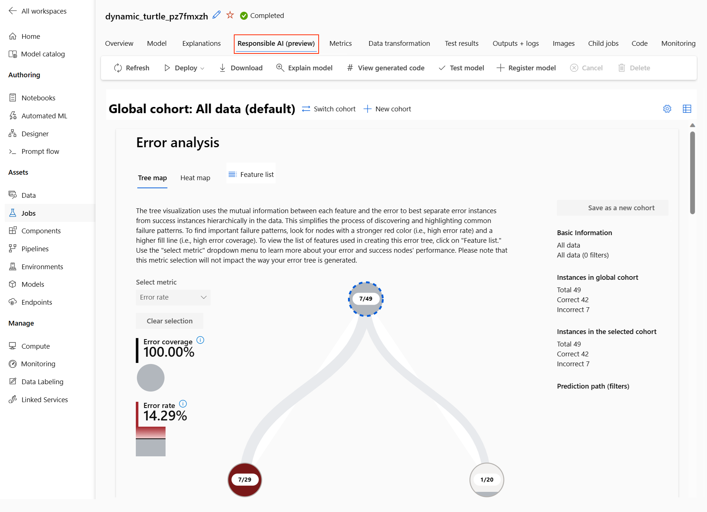
2.  **Create new AutoML experiment:**
    *   In the left-hand navigation pane, select **Automated ML**.
    *   Click on **+ New automated ML job**.

    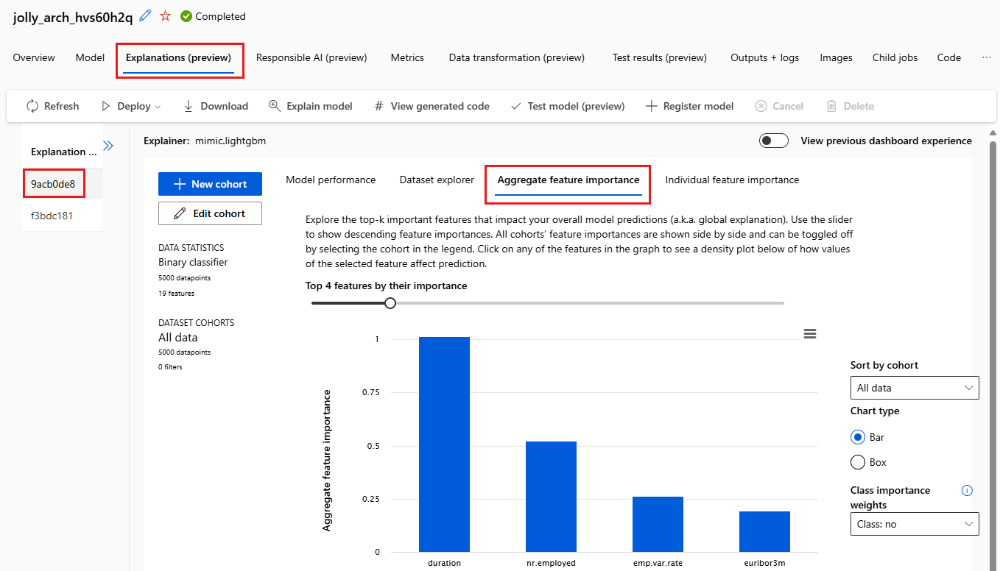
3.  **Configure your experiment:**
    *   **Upload or select dataset:** Choose your dataset containing patient/device data. Ensure it includes a target column for prediction (e.g., `Alert_Flag`).

    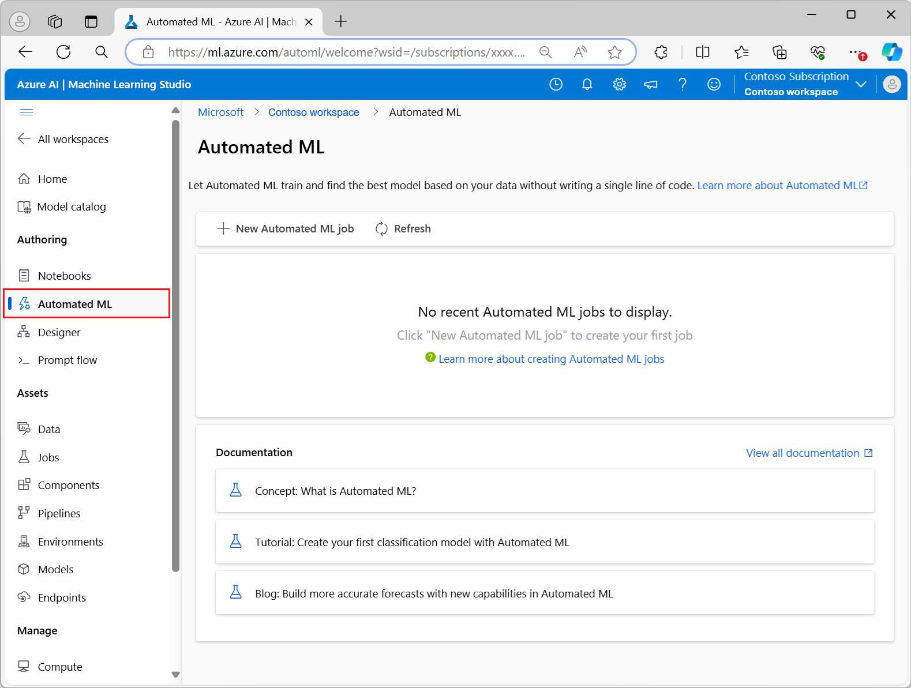
    *   **Define target column:** Specify your target column (e.g., `Alert_Flag`).
    *   **Choose task type:** Select the appropriate task type (e.g., `Classification` for predicting alerts).

    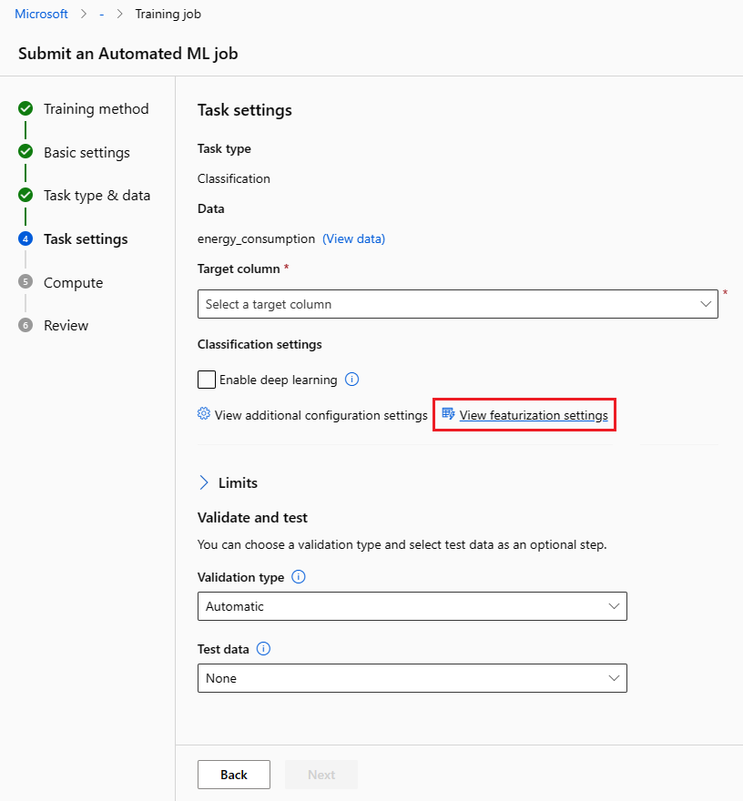
4.  **Deploy the best model as a real-time endpoint:** Once the AutoML experiment completes and identifies the best model, you need to deploy it.
    *   Navigate to the **Models** tab within your AutoML job run.
    *   Select the best performing model and click on **Deploy** > **Deploy to real-time endpoint**.

    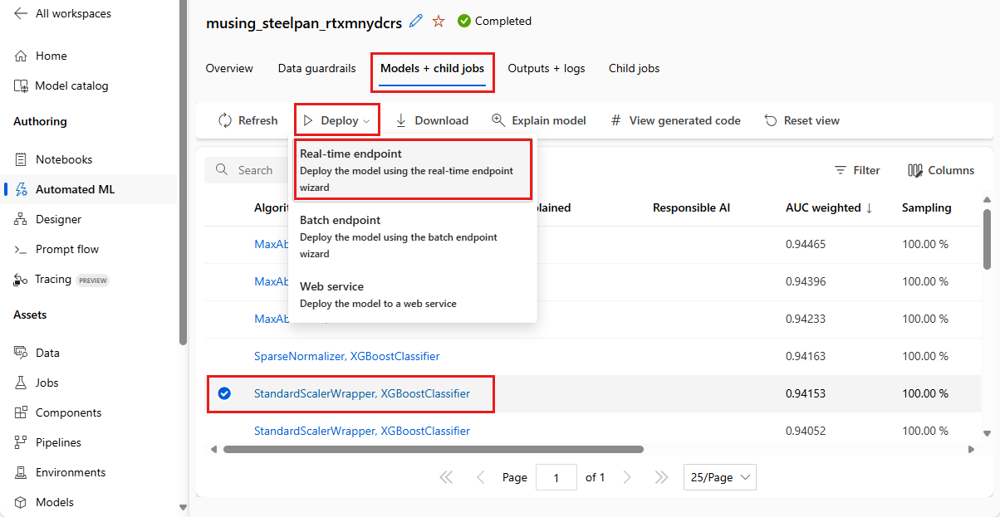
    *   **Note the endpoint URL, input schema, and API key:** These details are crucial for integrating with Power Automate. You can find them in the **Endpoints** section of your Azure ML Workspace after deployment.

    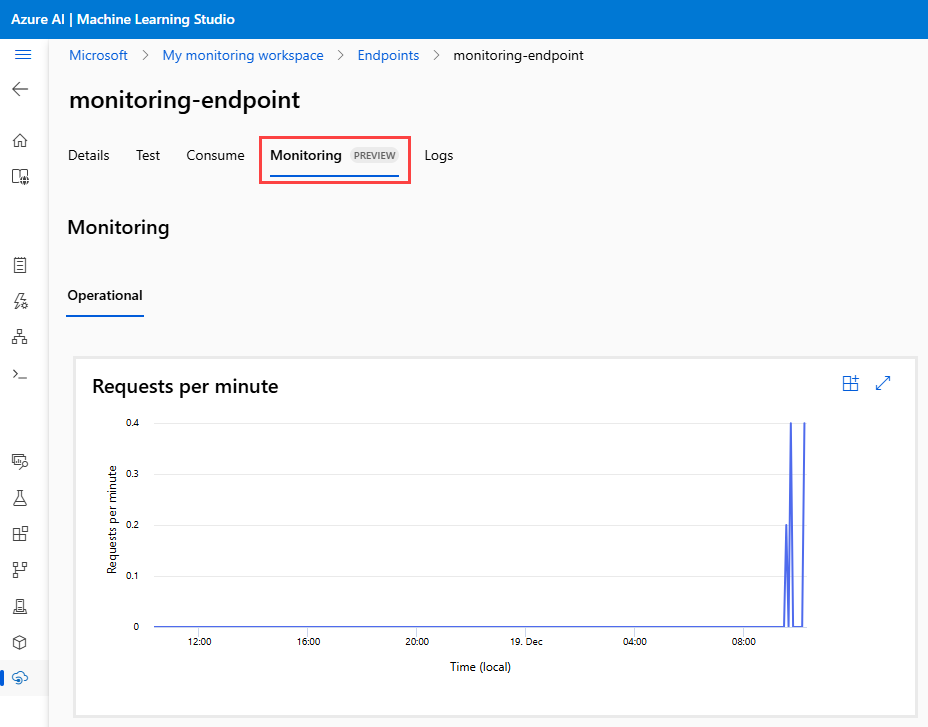
### 🔹 Step 2: Create Power Automate Flow

This section details how to initiate your Power Automate flow.

1.  **Visit Power Automate:** Open your web browser and go to [https://flow.microsoft.com](https://flow.microsoft.com).

    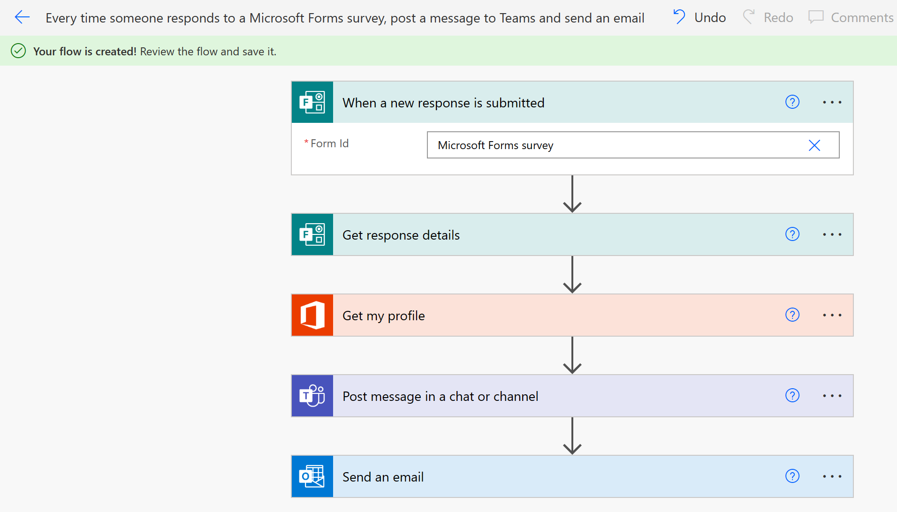
2.  **Select Create > Automated cloud flow:**

    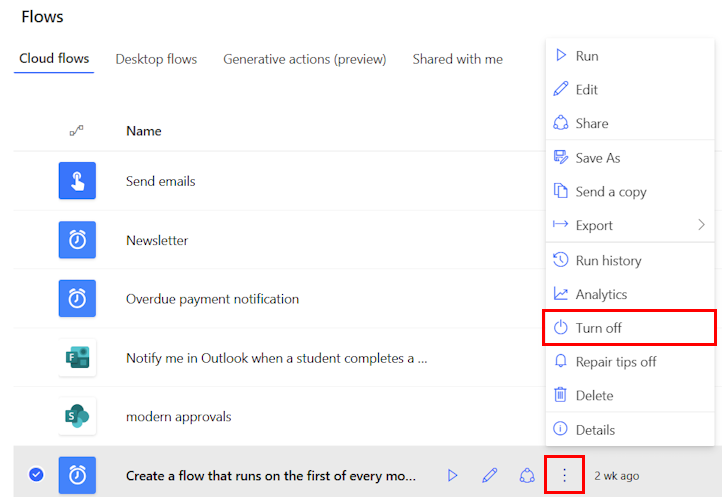
3.  **Choose a trigger:** Based on your data source, select the appropriate trigger.
    *   **“When a new row is added” (Excel):**

        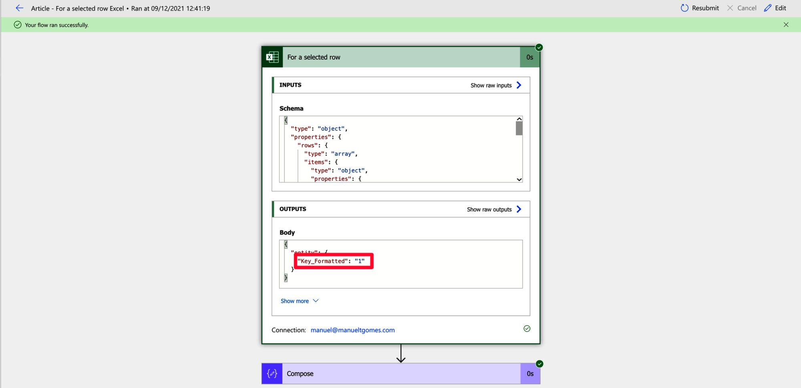
    *   **“When an item is created” (SharePoint):**

        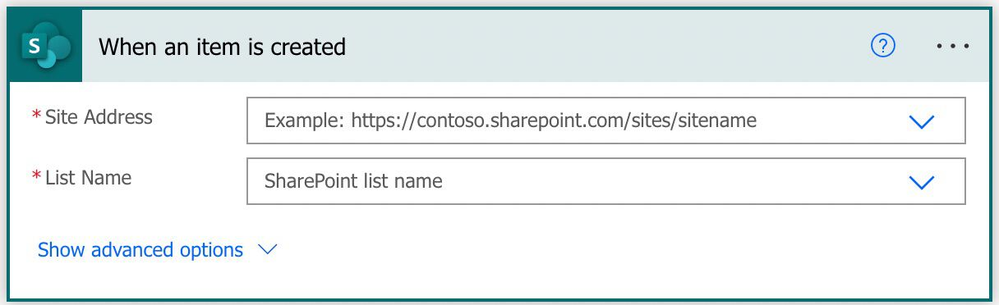
### 🔹 Step 3: Format Data as JSON

Use a **Compose** or **Select** block to structure the input data into the JSON format required by your Azure AutoML endpoint.

1.  **Add a Compose action:** Search for "Compose" and add the action.

    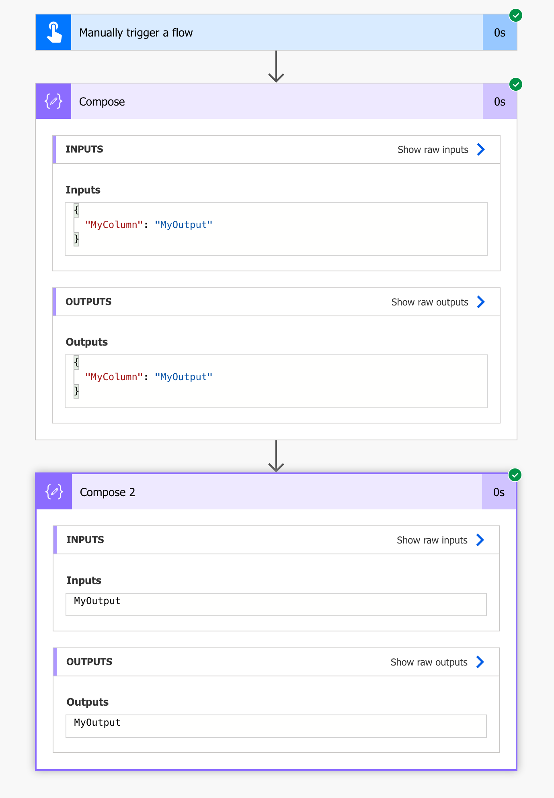
2.  **Configure Compose action:** Input the JSON structure with dynamic content from your trigger.

    ```json
    {
      "Inputs": {
        "data": [
          {
            "Patient_ID": "P123",
            "Heart_Rate": 98,
            "Blood_Oxygen": 91
          }
        ]
      }
    }
    ```

    *Replace `P123`, `98`, `91` with dynamic content from your trigger (e.g., from Excel or SharePoint).* 

    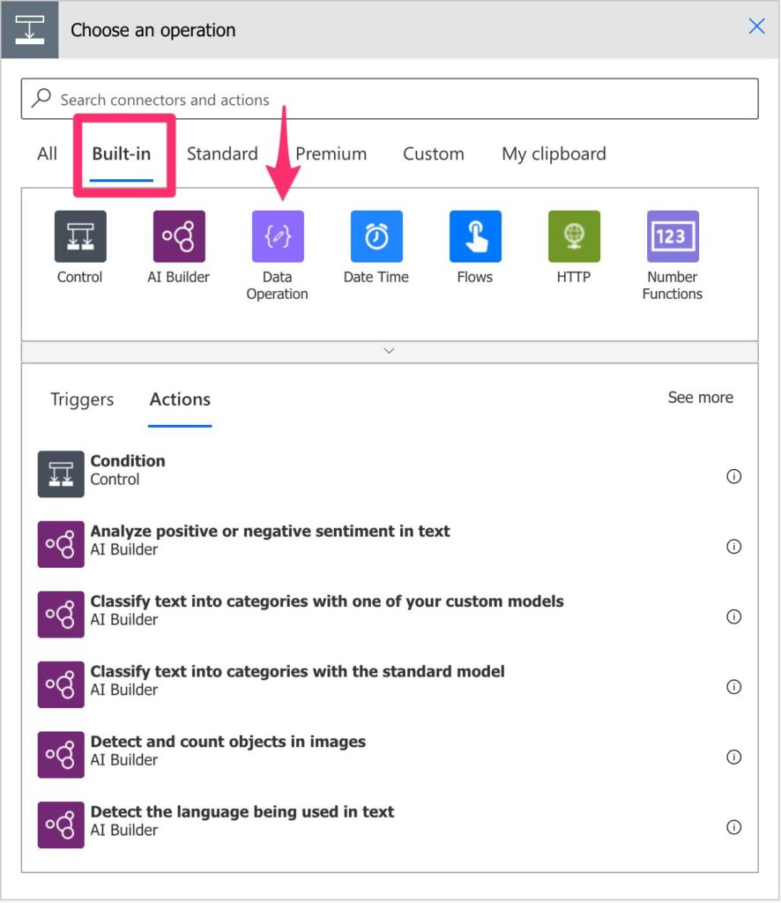
### 🔹 Step 4: Call AutoML API

Use the **HTTP** action to send a POST request to your Azure AutoML endpoint.

1.  **Add an HTTP action:** Search for "HTTP" and add the action.

    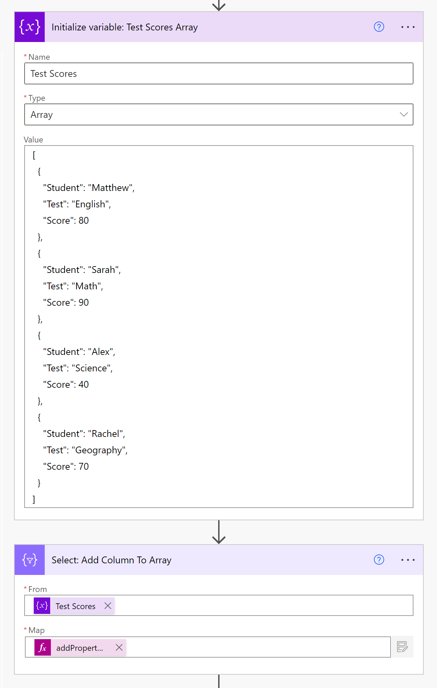
2.  **Configure HTTP action:**
    *   **Method:** `POST`
    *   **URI:** Your AutoML endpoint URL (from Step 1).
    *   **Headers:**
        *   `Authorization`: `Bearer <your-api-key>` (replace `<your-api-key>` with your actual API key from Step 1).
        *   `Content-Type`: `application/json`
    *   **Body:** Output from the previous **Compose** action.

    
### 🔹 Step 5: Parse JSON Response

Use the **Parse JSON** action to extract the "Scored Labels" from the AutoML API response.

1.  **Add a Parse JSON action:** Search for "Parse JSON" and add the action.

    
2.  **Configure Parse JSON action:**
    *   **Content:** Body from the **HTTP** action.
    *   **Schema:** Generate from a sample payload. The expected response format is:

        ```json
        {
          "Results": {
            "Scored Labels": 1
          }
        }
        ```

    
### 🔹 Step 6: Add Actions

Use a **Condition** block to define actions based on the prediction result.

1.  **Add a Condition action:** Search for "Condition" and add the action.

    
2.  **Configure Condition:** Set the condition to check if `Scored Labels` (from Parse JSON) is equal to `1` (or your anomaly flag).

    
3.  **If `Scored Labels` = 1 (Anomaly):**
    *   **Send Outlook email to clinician:** Add a "Send an email (V2)" action.

        
    *   **Log to SharePoint “Medical Alerts”:** Add a "Create item" action for SharePoint.

        
    *   **Trigger Microsoft Teams notification:** Add a "Post a message" action for Microsoft Teams.

        
4.  **Else (Normal Record):**
    *   **Log as normal patient record:** Add an action to log the normal record, e.g., another SharePoint "Create item" action to a different list or an Excel row.

        
---

## 🧪 Example

| Column       | Value  |
|--------------|--------|
| Patient_ID   | P123   |
| Heart_Rate   | 110    |
| Blood_Oxygen | 89     |

Prediction: `"Scored Labels": 1` → Sends alert: “Patient P123 needs attention.”

---

## 🔐 Notes on Security & Compliance

- Ensure patient data is anonymized and compliant with **HIPAA / GDPR**
- Use **Azure Key Vault** to manage sensitive API tokens
- Use HTTPS endpoints only

---

## 💬 Need Help?

For customization, integration, or automation enhancements, feel free to reach out or fork this project on GitHub.


